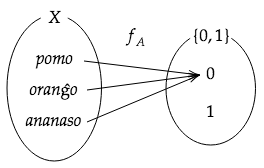

# {{ page.title }}
  
## 7.1 Forteco de nombrebla senfino  
Laǔ lekciono 6, forteco(kardinalo) de naturanombro estas nombrebla senfino kaj oni difinas kiel $$|\mathbb{N}|=\aleph_0 $$(alefo-nul). Plenanombro kaj onigeblanombro ankaǔ estas nombrebla senfino. 
  
$$
\begin{align*}
|\mathbb{N}|=|\mathbb{Z}|=|\mathbb{Q}|=\aleph_0
\end{align*}
$$
  
Oni scias, ke oni povas decidi respondon dum aroj por nombri eroj de aro. Sed, oni ne povas nombri erojn de realanombro. Realanombro ne estas nombrebla senfino. Forteco de realanombro grandas pli ol naturanombro.  
  
$$
\begin{align*}
|\mathbb{R}|\neq|\mathbb{N}|=\aleph_0
\end{align*}
$$  
  
En la parteto 7.2, oni demonstru, ke forteco de realanombro ne egalas al forteco de naturanombro, uzante "diagonala logiko de Cantor".  
  
  
## 7.2 Forteco de realanombro
Oni volas ekzameni fortecon de realanombro, sed ĉi-foje ni ekzamenos fortecon de fermita intervalo $$(0,1)$$ . Ĉar oni povas fari dissurĵeton $$\mathbb{R}\to (0,1)$$, forteco de $$(0,1)$$ egalas fortecon de realanombro (ekzempre ς-forma(sigmoida) funkcio $$\varsigma_1(x)=\frac{1}{1+e^{-x}}$$).  
  
{:.img}  
  
  
Eke, oni supozas, ke oni povas nombri ĉion da realanombroj sur $$(0,1)$$.  
  
$$
\begin{align*}
&0:&0.314&15926\cdots \\
&1:&0.111&11111\cdots \\
&2:&0.500&00000\cdots \\
&3:&0.301&02999\cdots \\
&4:&0.477&12125\cdots \\
&5:&0.141&42135\cdots \\
&6:&0.271&82818\cdots \\
&7:&0.114&51419\cdots \\
&\vdots&&\vdots
\end{align*}
$$  
  
Nun, oni elektas numerojn diagonale, kaj faras novan realanombro aliige la numerojn al jenaj numeroj. Numero 0 aliiĝas al 1, 1 aliiĝas 2, ktp, sed 9 aliiĝas 0. En la suba ekzemplo, de $$\color{red}{311002119}$$ fariiĝas nova nombro $$\color{blue}{0.42113220}$$.  
  
$$
\begin{align*}
&0:&0.\color{red}314&15926\cdots \\
&1:&0.1\color{red}11&11111\cdots \\
&2:&0.50\color{red}0&00000\cdots \\
&3:&0.301&\color{red}02999\cdots \\
&4:&0.477&1\color{red}2125\cdots \\
&5:&0.141&42\color{red}135\cdots \\
&6:&0.271&828\color{red}18\cdots \\
&7:&0.114&5141\color{red}9\cdots \\
&\vdots&&\vdots \\
&\color{blue}{?:}&\color{blue}{0.421}&\color{blue}{13220\cdots}
\end{align*}
$$  
  
Nu, ĉu la nova nombro farite estas en $$(0,1)$$? La respondo estas "ne". Se la nombro estas la 1000-a nombro, la 1000-a numero de la nova nombro ne egalas al la 1000-a numero de la originala nombro, ĉar oni faris la nova nombro per aliigi la 1000-an numeron de la originala nombro.  
  
$$
\begin{align*}
1000&:0.42113220\cdots\color{red}6\cdots \\
1000?&:0.42113220\cdots\color{blue}7\cdots
\end{align*}
$$  
  
Tio signifas, la supozo nombrebli realanombrojn misis. Oni ne povas nombri realanombrojn. Por ĉi tio, forteco de realanombro ne egalas al naturanombro.
  
  
## 7.3 Potencaro
Laǔ antaǔa parteto $$|\mathbb{R}|\neq|\mathbb{N}|$$. Efektive, forteco de realanombro estas forteco de potencaro de naturanombro.  
  
Potencaro estas aro de partaroj. Ekzemple, estas aro $$X$$ de fruktoj, tiel  
  
$$
\begin{align*}
X = \{pomo, oranĝo, ananaso\}
\end{align*}
$$  
  
Nun, kiam vi povas manĝi iom da specioj de fruktoj, la kombinaĵo estas  
  
$$
\begin{align*}
\left\{
\begin{array}{c}
\{pomo, oranĝo, ananaso\}, \\
\{pomo, oranĝo\},\{pomo, ananaso\},\{oranĝo, ananaso\}, \\
\{pomo\},\{oranĝo\},\{ananaso\}, \\
\{\}
\end{array}
\right\}
\end{align*}
$$  
  
Ĉi tiu aro estas potencaro, kaj oni formulas ĝin tiel $$\mathfrak{P}(X)$$ aǔ $$2^X$$. Pro rigardi, ke eroj de aro estas aǔ ne en ero de la partaro, nombro de $$\mathfrak{P}(X)$$ estas $$2^3$$.  
  
Nu, oni esprimas eroj de la partaroj de $$\mathfrak{P}(X)$$ per $$0$$ aǔ $$1$$. Por $$A\in2^X=\mathfrak{P}(X), x\in X$$, oni difinos jenan mapon $$f_A$$.  
  
$$
f_A(x)= \begin{cases}
1&(x\in A) \\
0&(x\in A^c)
\end{cases}
$$  
  
Ĝi signifas, ke $$f_A(x)=1$$ se $$x$$ estas en partaro $$A$$ kaj $$f_A(x)=0$$ se $$x$$ "ne" estas en la partaro. Ekzemple, se $$A={pomo, ananaso}\in 2^X$$, $$f_A(pomo)=1$$ ĉar $$pomo\in X$$ estas en la partaro $$A$$. $$f_A(oranĝo)=0$$ ĉar $$oranĝo$$ ne estas en $$A$$. Kaj $$f_A(ananaso)=1$$.  
  
Ili estas same kiel mapo $$X\to\{0,1\}$$.  
  
{:.img}  
  
  
En alia ekzemplo, se $$A=\{\}$$, $$f_A(x)=0$$ pri ĉiuj $$x\in X$$.  
  
{:.img}  
  
  
Nu, oni dificas $$Y^X:=$$ĉiuj mapoj el $$X$$ al $$Y$$, kaj $$\{0,1\}^X$$ signifas la aro de ĉiuj mapoj el $$X$$ al $$\{0,1\}^X$$. Ĝi estas la aro de ĉiuj subaj mapoj $$f_A\in\{0,1\}^X$$.  
  
$$
\begin{align*}
\left\{
\begin{array}{c}
(1, 1, 1), \\
(1, 1, 0),(1, 0, 1),(0, 1, 1), \\
(1, 0, 0),(0, 1, 0),(0, 0, 1), \\
(0, 0, 0)
\end{array}
\right\}
\end{align*}
$$  
  
Oni pripensos mapon $$T:\{0,1\}^X\to2^X$$, tiel  
  
$$
\begin{align*}
T(f_A)=\{x\in X \mid f_A(x)=1\}
\end{align*}
$$  
  
Ĉar $$T(f_A)=A\in\mathfrak{P}(X)$$, la mapo$$T$$ estas dissurĵeto.  

## 7.4 Duuma disvolvo de realanombro
Oni povas skribi realanombron $$x$$ tiel sumo de plenanombra parto $$x$$ kaj nombreta parto $$y$$.  
  
$$
\begin{align*}
x=z+y\hspace{1em}(z\in\mathbb{Z}, y\in [0,1))
\end{align*}
$$  
  
Ekzemple, $$x=6.9375$$ dispartiĝeblas per $$z=6$$ kaj $$y=0.9375$$.  
  
Nu, ni disvolvigos realanombron al duuma nombro. Nun $$x=6.9375$$. Unue, ni disvolvos plenanombra parto $$z=6$$. Ĉar bazoj estas potencoj de 2,  
  
$$
\begin{align*}
z=6=1\times2^2+1\times2^1+0\times2^0
\end{align*}
$$  
  
Same, nombreta parto ankaǔ disvolviĝas, tiel  
  
$$
\begin{align*}
y=0.9375=1\times2^{-1}+0\times2^{-2}+1\times2^{-3}+1\times2^{-4}
\end{align*}
$$  
  
Ĝenerale, oni povas duumi realanombron $$x$$ per $$a_n\in \{0,1\}$$(signifi "0 aǔ 1"), tiel  
  
$$
\begin{align*}
x&=\cdots a_2 2^2+a_1 2^1+ a_0 2^0 + a_{-1}2^{-1}+a_{-2}2^{-2}\cdots \\
&=\sum_{n=-\infty}^{\infty}a_n2^n\hspace{1em}(a_n\in \{0,1\})
\end{align*}
$$  
  
Nun, oni pripensos nur nombretan parton.  
  
$$
\begin{align*}
y=\frac{a_1}{2^1}+\frac{a_2}{2^2}+\cdots+\frac{a_m}{2^m}+\cdots\hspace{1em}(a_m\in\{0,1\}, m\in\mathbb{N})
\end{align*}
$$  
  
Pri $$y\in[0,1)$$, oni respondigas $$\{a_m\}_{m=1}^{\infty}\in\{0,1\}^{\mathbb{N}}$$. Ĝi signifas $$[0,1)\to\{0,1\}^{\mathbb{N}}$$.
  
## 7.5 Forteco de kontinuaĵa kaj nombrebla senfino
Ni demonstros $$|\mathbb{R}|=|\mathfrak{P}(\mathbb{N})|$$, sed demonstri rekte estas malfacile. Ni pripensas demonstri pro dissurĵetoj $$\mathfrak{P}(\mathbb{N})\to\{0,1\}^{\mathbb{N}}$$, $$\{0,1\}^{\mathbb{N}}\to(0,1)$$, kaj $$(0,1)\to\mathbb{R}$$ (ĉar forteco de 2 aroj egalas se mapo dum la 2 aroj dissurĵetas).  
  
{:.img}  
  
  
$$\mathfrak{P}(\mathbb{N})\to\{0,1\}^{\mathbb{N}}$$ kaj $$(0,1)\to\mathbb{R}$$ estas dissur   ĵetoj, laû 7.2 kaj 7.3. Sube, pro 7.2, $$\varphi_5 = \varsigma_1^{-1}:(0,1)\to\mathbb{R}$$, kaj pro 7.3, $$\varphi_1 = T^{-1}:\mathfrak{P}(\mathbb{N})\to\{0,1\}^{\mathbb{N}}$$ estas dissurĵetoj. Ĉar demonstri rekte ke $$\{0,1\}^{\mathbb{N}}\to(0,1)$$ estas dissurĵeto ankaǔ estas malfacile, ni adicos krome 2 mapojn.  
  
{:.img}  
  
  
Oni povas demonstri, ke $$\{0,1\}^{\mathbb{N}}\to(0,1)$$ estas dissurĵeto, per uzi teoremon de Bernstein (detale en 7.6). La teoremo diras, ke pri du aroj $$A$$ kaj $$B$$, se disĵeto $$f:A\to B$$ kaj disĵeto $$g:B\to A$$ ambaǔ ekzistas, dissurĵeto $$h:A\to B$$ ekzistas, resume forteco de $$A$$ kaj $$B$$ egalas.  
  
Detalan demonstron klarigos poste, kaj dumtempe oni demonstros, ke $$\varphi_2$$, $$\varphi_3$$, kaj $$\varphi_4$$ estas disĵetoj.  
  
{:.img}  
  
  
Eke, pri funkcio $$\varphi_3(x)=x$$, la mapo $$\varphi_3:(0,1)\to[0,1)$$ estas disĵeto (neesti $$x$$ verigi $$\varphi_3(x)=0$$ ne problemas pro disĵeto). Kaj laǔ 7.4, $$\varphi_4:[0,1)\to\{0,1\}^{\mathbb{N}}$$ ankaǔ estas disĵeto.  
  
Jene oni faros mapon $$\varphi_2:\{0,1\}^{\mathbb{N}}\to(0,1)$$. Pri nombrovico $$a=(a_1,a_2,a_3,\cdots)\in\{0,1\}^{\mathbb{N}}$$, funkcio $$\varphi_2(a)$$  
  
$$
\begin{align*}
\varphi_2(a)=\frac{1}{4}+\frac{1}{2}\sum_{n=1}^{\infty}\frac{a_n}{2^n}
\end{align*}
$$  
  
estas disĵeto $$\{0,1\}^{\mathbb{N}}\to[1/4,3/4]$$, resume disĵeto $$\{0,1\}^{\mathbb{N}}\to(0,1)$$.  
  
El la sube, 

$$|\mathfrak{P}(\mathbb{N})|=|\{0,1\}^{\mathbb{N}}|=|(0,1)|=|\mathbb{R}|$$

  
  
## 7.6 Teoremo de Bernstein
Teoremo de Bernstein diras, ke pri du aroj $$A$$ kaj $$B$$, se disĵeto $$f:A\to B$$ kaj disĵeto $$g:B\to A$$ ambaǔ ekzistas, dissurĵeto $$h:A\to B$$ ekzistas, resume forteco de $$A$$ kaj $$B$$ egalas.  
